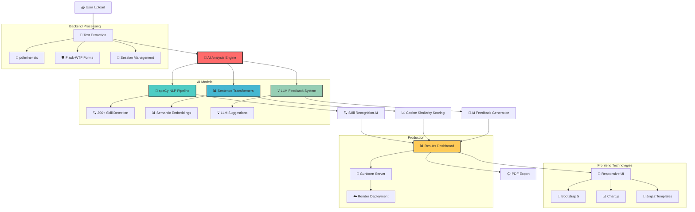

# 🤖 AI Resume Reviewer & Job Matcher

**Intelligent Resume Analysis with LLM-Powered Feedback**

[](https://python.org)
[](https://flask.palletsprojects.com/)
[](LICENSE)
[](https://render.com)

> **Transform your job search with AI-powered resume analysis, skill gap detection, and personalized feedback.**

## ✨ Features

### 🎯 **Smart Resume Analysis**
- **Semantic Job Matching** - AI-powered similarity scoring
- **Skill Gap Analysis** - Identify missing skills for job requirements
- **ATS Optimization** - Pass automated screening systems
- **Real-time Feedback** - Instant actionable suggestions

### 🤖 **Advanced AI Models**
- **🤖 Sentence Transformers (all-MiniLM-L6-v2)** - State-of-the-art semantic text analysis
- **🧠 spaCy NLP Engine** - Professional-grade natural language processing
- **🔍 Skill Recognition AI** - Intelligent detection of 200+ technical skills
- **📊 Cosine Similarity Scoring** - Mathematical precision in job matching
- **💡 LLM-Powered Feedback** - GPT-style suggestions for resume improvement

### 📊 **Comprehensive Reports**
- **PDF Export** - Professional downloadable reports
- **Visual Dashboard** - Interactive results display
- **Skill Comparison** - Side-by-side skill analysis
- **Improvement Roadmap** - Actionable next steps

## 🚀 Quick Start

### Prerequisites
- Python 3.11+
- pip package manager
- Modern web browser

### Installation

1. **Clone the repository**
   ```bash
   git clone https://github.com/HassanCodesIt/Resume-Reviewer.git
   cd Resume-Reviewer
   ```

2. **Install dependencies**
   ```bash
   pip install -r requirements.txt
   python -m spacy download en_core_web_sm
   ```

3. **Set up environment variables**
   ```bash
   # Create .env file
   echo "SECRET_KEY=your-secret-key-here" > .env
   ```

4. **Run the application**
   ```bash
   python run.py
   ```

5. **Open your browser**
   ```
   http://localhost:5000
   ```

## 🛠️ Complete Tech Stack

### **🌐 Frontend Technologies**
- **🎨 Bootstrap 5** - Modern, responsive UI framework
- **📊 Chart.js** - Interactive data visualization and analytics
- **🔧 Jinja2** - Server-side templating engine
- **💅 Custom CSS** - Enhanced styling and animations
- **⚡ Custom JavaScript** - Dynamic user interactions
- **📱 Responsive Design** - Mobile-first approach

### **⚙️ Backend Framework**
- **🐍 Flask** - Lightweight Python web framework
- **🛡️ Flask-WTF** - Form handling and CSRF protection
- **🔐 python-dotenv** - Environment variable management
- **🔄 Session Management** - User state handling
- **📁 File Upload Handling** - Secure file processing

### **🤖 AI & Machine Learning**
- **🧠 Sentence Transformers (all-MiniLM-L6-v2)** - State-of-the-art semantic text embeddings
- **🔍 spaCy (en_core_web_sm)** - Professional NLP pipeline with 200+ skill recognition
- **📈 scikit-learn** - Machine learning algorithms for similarity scoring
- **🚀 Transformers (Hugging Face)** - Advanced language model integration
- **📊 Cosine Similarity** - Mathematical precision in job-resume matching
- **💡 Lazy Loading** - Memory-optimized model loading
- **🔄 Fallback Mechanisms** - Graceful error handling

### **📄 File Processing & Export**
- **📖 pdfminer.six** - Advanced PDF text extraction
- **📋 pdfkit** - PDF report generation
- **🌐 wkhtmltopdf** - HTML to PDF conversion
- **📁 File Upload System** - Secure document handling
- **🗂️ Temporary File Management** - Clean file processing

### **🚀 Production & Deployment**
- **🐳 Gunicorn** - Production WSGI server
- **☁️ Render** - Cloud deployment platform
- **🔧 Procfile** - Deployment configuration
- **📦 Requirements Management** - Dependency optimization
- **🌍 Environment Variables** - Secure configuration

### **🔧 Development & Tools**
- **📝 Git** - Version control
- **🐛 Error Handling** - Comprehensive logging
- **⚡ Performance Optimization** - Memory and speed improvements
- **🛠️ Debugging Tools** - Development assistance

## 📖 Complete Workflow Guide

### **🔄 Step-by-Step Process**

#### **📤 Step 1: Document Upload**
- **📄 Resume Upload** - PDF or text format supported
- **📋 Job Description** - Upload file or paste text
- **🛡️ Security** - Files processed securely with Flask-WTF
- **📁 Storage** - Temporary session-based storage

#### **🤖 Step 2: AI Processing Pipeline**
- **📖 Text Extraction** - pdfminer.six extracts text from PDFs
- **🧠 NLP Processing** - spaCy analyzes document content
- **📊 Semantic Analysis** - Sentence Transformers create embeddings
- **🔍 Skill Detection** - AI identifies 200+ technical skills
- **📈 Similarity Scoring** - Cosine similarity calculates job fit

#### **💡 Step 3: AI Insights Generation**
- **🎯 Match Score** - Percentage-based job fit analysis
- **📊 Skills Comparison** - Resume vs. job requirements
- **🔍 Gap Analysis** - Missing skills identification
- **💭 LLM Feedback** - Personalized improvement suggestions

#### **📊 Step 4: Results Dashboard**
- **📱 Responsive UI** - Bootstrap 5 mobile-first design
- **📊 Visual Analytics** - Chart.js interactive charts
- **📋 Detailed Reports** - Comprehensive analysis results
- **📄 PDF Export** - Professional downloadable reports

#### **🚀 Step 5: Production Deployment**
- **🐳 Gunicorn Server** - Production WSGI server
- **☁️ Render Platform** - Cloud deployment
- **🔧 Environment Config** - Secure variable management
- **📦 Optimized Dependencies** - Memory-efficient deployment

## 🏗️ AI-Powered Architecture



## 🔧 Configuration

### **Environment Variables**
```bash
SECRET_KEY=your-secret-key-here
HF_TOKEN=your-huggingface-token  # Optional for enhanced LLM features
```

### **Deployment**
The application is optimized for deployment on Render:

- **Runtime:** Python 3.13.4
- **Build Command:** `pip install -r requirements.txt`
- **Start Command:** `gunicorn run:app --bind 0.0.0.0:$PORT`

## 🐛 Troubleshooting

### **🤖 AI Model Optimization**

1. **Memory Issues on Deployment**
   - ✅ **Fixed:** Implemented lazy loading for AI models
   - ✅ **Fixed:** Optimized dependencies for production
   - ✅ **Enhanced:** Sentence Transformers load only when needed

2. **Import Errors**
   - ✅ **Fixed:** Updated Flask imports for compatibility
   - ✅ **Fixed:** Added markupsafe dependency

3. **Model Loading Issues**
   - ✅ **Fixed:** Added fallback mechanisms for spaCy
   - ✅ **Fixed:** Automatic spaCy model download
   - ✅ **Enhanced:** Graceful degradation when models fail

### **Local Development**
```bash
# If you encounter issues
pip install --upgrade pip
pip install -r requirements.txt --force-reinstall
python -m spacy download en_core_web_sm
```

## 🤝 Contributing

We welcome contributions! Here's how to get started:

1. **Fork the repository**
2. **Create a feature branch**
   ```bash
   git checkout -b feature/amazing-feature
   ```
3. **Make your changes**
4. **Test thoroughly**
5. **Submit a pull request**

### **Development Setup**
```bash
# Install development dependencies
pip install -r requirements.txt
python -m spacy download en_core_web_sm

# Run in development mode
python run.py
```

## 📄 License

This project is licensed under the MIT License - see the [LICENSE](LICENSE) file for details.

## 🙏 Acknowledgments

- **🤖 Hugging Face** - For state-of-the-art transformer models and inference API
- **🧠 spaCy** - For professional-grade natural language processing capabilities
- **📊 Sentence Transformers** - For advanced semantic text analysis
- **🔧 Flask** - For the lightweight web framework
- **🎨 Bootstrap** - For the responsive UI components

## 📞 Support

- **Issues:** [GitHub Issues](https://github.com/HassanCodesIt/Resume-Reviewer/issues)
- **Discussions:** [GitHub Discussions](https://github.com/HassanCodesIt/Resume-Reviewer/discussions)
- **Email:** [Contact via GitHub](https://github.com/HassanCodesIt)

---

**Made with ❤️ by [HassanCodesIt](https://github.com/HassanCodesIt)**

*Transform your job search with AI-powered insights!* 
